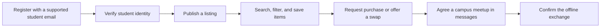

<p align="center">
  
</p>

<h1 align="center">unitrovee</h1>

<p align="center">
  <strong>A second-hand marketplace for students at Irish universities.</strong>
</p>

Unitrovee helps verified students buy, sell, swap, or give away useful items for campus life—such as textbooks, furniture, electronics, bikes, and kitchen essentials. It is being built as a portfolio-quality, full-stack learning project with a React frontend and a Spring Boot API.

> **Project status — active development.** Milestone 3 — Item Listings API and Image Uploads is complete. The backend foundation, supported-school directory, registration, email verification, login, JWT authentication, role-based access control, categories, item listings, public search and filtering, item detail, item lifecycle actions, local image uploads, database migrations, API documentation, and integration-test foundation are in place. The React frontend is not implemented yet; Milestone 4 — Frontend Foundation is next.
---

## Contents

- [What exists today](#what-exists-today)
- [Technology](#technology)
- [Roadmap](#roadmap)

## What exists today

### Implemented backend capabilities

- **Student-school matching** — registration accepts only email domains belonging to active, seeded Irish institutions.
- **Authentication** — BCrypt password hashing, login, signed JWT access tokens, and a stateless Spring Security filter chain.
- **Email verification** — registration creates a six-digit verification code; verified status is required before a student can create a listing.
- **Public school and category directories** — public endpoints provide supported schools and active item categories.
- **Item listings** — verified students can create `DRAFT` listings for `FREE`, `SWAP`, or `SELL` items. A `SELL` listing requires a positive EUR price; `FREE` and `SWAP` listings do not have a price.
- **Listing ownership and lifecycle** — owners can edit `DRAFT` and `AVAILABLE` listings, publish a draft, archive an available item, and permanently delete a draft.
- **Public marketplace browsing** — public users can view only `AVAILABLE` listings, with pagination and optional school, category, exchange-type, and keyword filters.
- **Item detail and privacy** — item detail returns public listing data, category, school, seller display name, and image URLs without exposing seller email addresses or internal storage keys.
- **Item images** — owners can upload up to eight JPEG, PNG, or WebP images to a draft or available listing. Files are validated and stored locally through the `StorageService` abstraction.
- **Database foundation** — PostgreSQL schema is managed with Flyway migrations; JPA auditing is enabled.
- **Consistent API responses** — success responses use `{ "data": ..., "message": ... }`; errors use `{ "error": { "code": ..., "message": ... } }`.
- **Developer tooling** — OpenAPI/Swagger UI, Actuator health checks, Docker Compose, and Testcontainers-backed integration tests.
- **Storage abstraction** — a `StorageService` contract with a local-disk implementation is in place, ready for a later S3/R2 adapter.

### Planned product flow



Email-domain matching, verification-code flow, listing creation, public browsing, filtering, item detail, lifecycle actions, and image uploads are implemented now. Favorites, trade requests, and messaging remain future work.

## Technology

| Area | Current or planned technology |
| --- | --- |
| Backend | Java 21, Spring Boot 3.5, Spring Web MVC |
| Security | Spring Security, JWT, BCrypt |
| Persistence | PostgreSQL 16 with pgvector image, Spring Data JPA, Flyway |
| API documentation | springdoc-openapi / Swagger UI |
| Testing | JUnit 5, Spring Boot Test, Testcontainers PostgreSQL |
| Local infrastructure | Docker Compose |
| Frontend *(planned)* | React 19, TypeScript, Vite, TanStack Query, React Hook Form, Zod, Tailwind CSS |
| AI support *(later)* | Spring AI, PostgreSQL pgvector, RAG |


## Roadmap

The planned product flow supports sales, free items, and item-for-item swaps. Payments remain
offline: the platform records confirmations but never processes or stores payment details.

The MVP foundation focuses on this listing loop:

```text
Register + verify → publish item → search/filter → view item → favorite/contact → update status
```

| Phase | Focus | Status         |
| --- | --- |----------------|
| 0 | Setup & Tooling | Completed ✅   |
| 1 | Backend foundation | Completed ✅   |
| 2 | Authentication, users, and schools | Completed ✅   |
| 3 | Item listings API and image endpoints | Completed ✅   |
| 4–5 | React foundation and MVP pages | In progress 🛠️ |
| 6 | Trust, moderation, reviews, and Redis | Planned    🚩  |
| 7 | Messaging and trade negotiation | Planned    🚩  |
| 8 | RAG support assistant with Spring AI and pgvector | Planned     🚩 |
| 9 | Deployment and documentation | Planned    🚩  |
