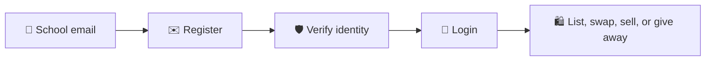
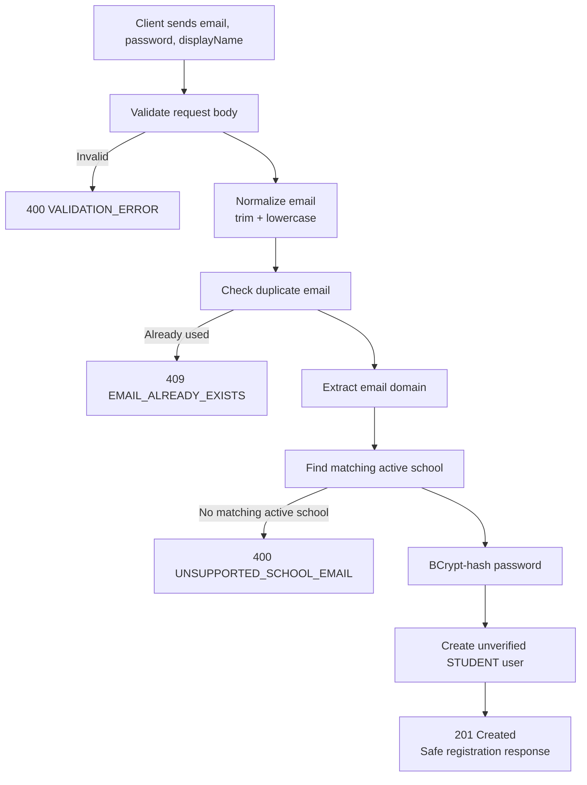
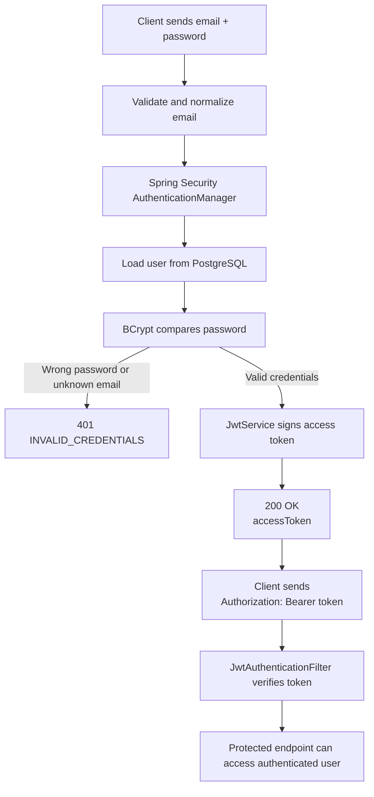

# Unitrovee

Unitrovee is a planned full-stack marketplace for verified students across Irish
universities. The goal is to help students sell, swap, or give away useful
second-hand items such as textbooks, furniture, electronics, bikes, kitchen
items, and other campus-life essentials.

