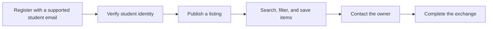

<p align="center">
  
</p>

<h1 align="center">unitrovee</h1>

<p align="center">
  <strong>A second-hand marketplace for students at Irish universities.</strong>
</p>

Unitrovee helps verified students buy, sell, swap, or give away useful items for campus life—such as textbooks, furniture, electronics, bikes, and kitchen essentials. It is being built as a portfolio-quality, full-stack learning project with a React frontend and a Spring Boot API.

> **Project status — active development.** The backend foundation, supported-school directory, registration, login, JWT authentication, local file-storage abstraction, database migrations, API documentation, and integration-test foundation are in place. The React frontend and marketplace listings are not implemented yet.

---

## Contents

- [What exists today](#what-exists-today)
- [Technology](#technology)
- [Roadmap](#roadmap)

## What exists today

### Implemented backend capabilities

- **Student-school matching** — registration accepts only email domains belonging to active, seeded Irish institutions.
- **Authentication** — BCrypt password hashing, login, signed JWT access tokens, and a stateless Spring Security filter chain.
- **Public school directory** — paginated school listing and individual-school lookup endpoints.
- **Database foundation** — PostgreSQL schema managed with Flyway migrations; JPA auditing is enabled.
- **Consistent API responses** — success responses use `{ "data": ..., "message": ... }`; errors use `{ "error": { "code": ..., "message": ... } }`.
- **Developer tooling** — OpenAPI/Swagger UI, Actuator health checks, Docker Compose, and Testcontainers-backed integration tests.
- **Storage abstraction** — a `StorageService` contract with a local-disk implementation, ready for item-image endpoints and a later S3/R2 adapter.

### Planned product flow



Email-domain matching is implemented now; a verification-code flow is a planned trust-root feature before listings are treated as verified-student listings.

## Technology

| Area | Current or planned technology |
| --- | --- |
| Backend | Java 21, Spring Boot 3.5, Spring Web MVC |
| Security | Spring Security, JWT, BCrypt |
| Persistence | PostgreSQL 16 with pgvector image, Spring Data JPA, Flyway |
| API documentation | springdoc-openapi / Swagger UI |
| Testing | JUnit 5, Spring Boot Test, Testcontainers PostgreSQL |
| Local infrastructure | Docker Compose |
| Frontend *(planned)* | React 19, TypeScript, Vite, TanStack Query, React Hook Form, Zod, Tailwind CSS |
| AI support *(later)* | Spring AI, PostgreSQL pgvector, RAG |


## Roadmap

The MVP focuses on one complete exchange loop:

```text
Register + verify → publish item → search/filter → view/favorite/contact → update status
```

| Phase | Focus | Status |
| --- | --- | --- |
| 1 | Backend foundation | Complete |
| 2 | Authentication, users, and schools | In progress |
| 3 | Item listings API and image endpoints | Planned |
| 4–5 | React foundation and MVP pages | Planned |
| 6 | Trust, moderation, reviews, and Redis | Planned |
| 7 | Messaging with WebSocket/STOMP | Planned |
| 8 | RAG support assistant with Spring AI and pgvector | Planned |
| 9 | Deployment and documentation | Planned |